# Báo cáo đồ án

## 1. Tên đề tài

**Phân tích ảnh hưởng của mạng xã hội đến mức độ căng thẳng tâm lý của trẻ vị thành niên**.

Mục tiêu của đồ án là xây dựng một quy trình phân tích dữ liệu và mô hình dự đoán để trả lời ba câu hỏi chính:

1. Mạng xã hội và các thói quen số có liên hệ như thế nào với mức độ căng thẳng tâm lý?
2. Có thể dự đoán tình trạng căng thẳng hoặc nguy cơ trầm cảm từ các đặc trưng hành vi không?
3. Có thể phân nhóm người dùng thành các persona có ý nghĩa để hỗ trợ diễn giải và can thiệp không?

## 2. Mô tả bài toán

Đây là bài toán phân tích dữ liệu sức khỏe tâm lý theo hướng dự đoán và diễn giải.

### 2.1 Đầu vào

Đầu vào của bài toán là các đặc trưng hành vi và nhân khẩu học của trẻ vị thành niên, ví dụ:

- Thời gian dùng mạng xã hội mỗi ngày.
- Thời gian nhìn màn hình trước khi ngủ.
- Số giờ ngủ.
- Mức độ hoạt động thể chất.
- Mức tương tác xã hội.
- Kết quả học tập.
- Mức stress và anxiety.

### 2.2 Đầu ra

Đầu ra chính gồm 2 nhóm:

- **Phân loại nhị phân**: dự đoán nhãn `depression_label` để xác định trạng thái nguy cơ.
- **Phân cụm diễn giải**: gom người dùng vào các persona có ý nghĩa như nhóm dùng mạng xã hội nhiều, nhóm stress cao, nhóm lối sống lành mạnh.

### 2.3 Mục tiêu bài toán

Mục tiêu không chỉ là đạt điểm số cao, mà còn phải:

- Phát hiện tốt lớp thiểu số.
- Hạn chế false negative với nhóm có nguy cơ cao.
- Giữ được khả năng diễn giải để dùng trong báo cáo và thảo luận.

### 2.4 Thách thức chính

Các điểm khó của bài toán là:

- Dữ liệu có mất cân bằng lớp.
- Quan hệ giữa mạng xã hội và sức khỏe tâm lý là đa yếu tố, không tuyến tính đơn giản.
- Cần cân bằng giữa hiệu năng dự đoán và khả năng giải thích.

## 3. Bối cảnh và động lực

Trẻ vị thành niên là nhóm chịu ảnh hưởng mạnh từ thời gian dùng mạng xã hội, giấc ngủ, mức hoạt động thể chất, tương tác xã hội và áp lực học tập. Trong dữ liệu của dự án, các đặc trưng như số giờ dùng mạng xã hội, thời gian nhìn màn hình trước khi ngủ, mức ngủ, hoạt động thể chất, tương tác xã hội, stress và anxiety được dùng để phân tích mối liên hệ với `depression_label`.

Đồ án không chỉ dừng ở bài toán phân loại nhị phân, mà còn mở rộng sang:

- Phân tích EDA để nhìn trực quan mối liên hệ giữa hành vi số và sức khỏe tâm lý.
- Dự đoán bằng các mô hình machine learning và deep learning.
- Phân cụm đa góc nhìn để tạo persona người dùng.

## 4. Mô tả dữ liệu

Pipeline dữ liệu của dự án được tổ chức thành 3 bộ chính:

- `train_data.csv`: tập huấn luyện.
- `validation_data.csv`: tập kiểm tra trung gian để chọn ngưỡng và so sánh mô hình.
- `test_data.csv`: tập đánh giá cuối cùng.

Các đặc trưng chính xuất hiện trong notebook và các biểu đồ gồm:

- `daily_social_media_hours`
- `screen_time_before_sleep`
- `sleep_hours`
- `physical_activity`
- `social_interaction_level`
- `academic_performance`
- `stress_level`
- `anxiety_level`
- `depression_label`

Từ EDA, nhóm biểu đồ nổi bật trong `figures/eda/` cho thấy:

- Phân bố nhãn và mất cân bằng lớp.
- Tương quan giữa các biến số và nhãn mục tiêu.
- Quan hệ giữa thời gian dùng mạng xã hội và mức stress.
- Các dạng phân bố theo giới tính, độ tuổi, nền tảng sử dụng.

### Figure tham khảo

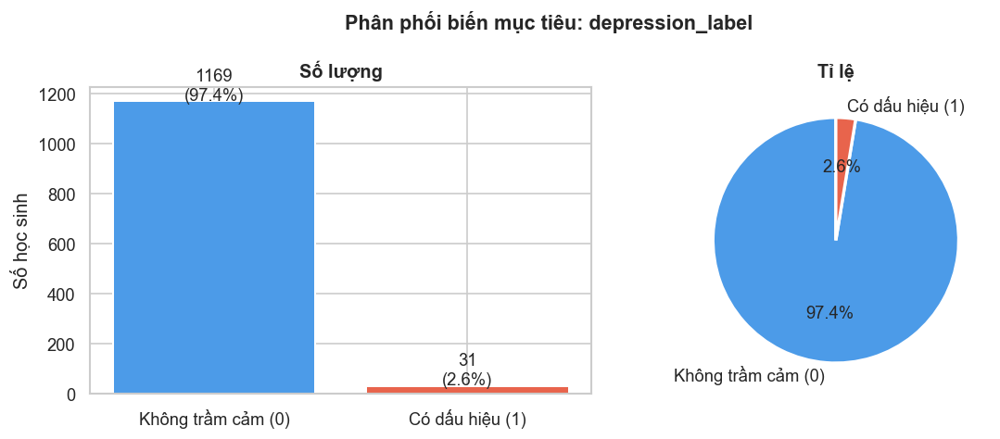

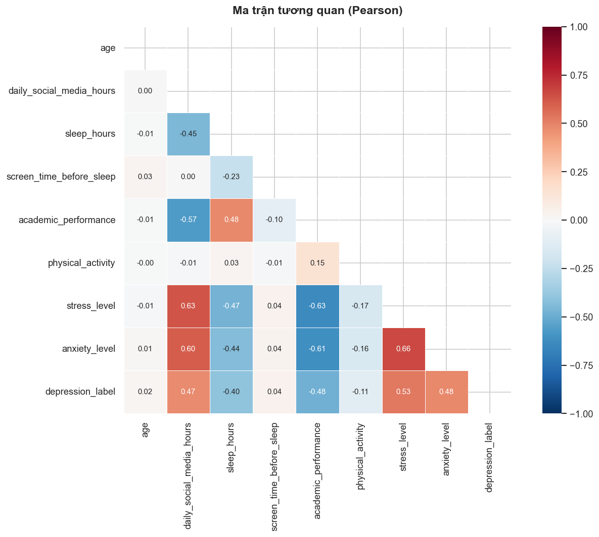

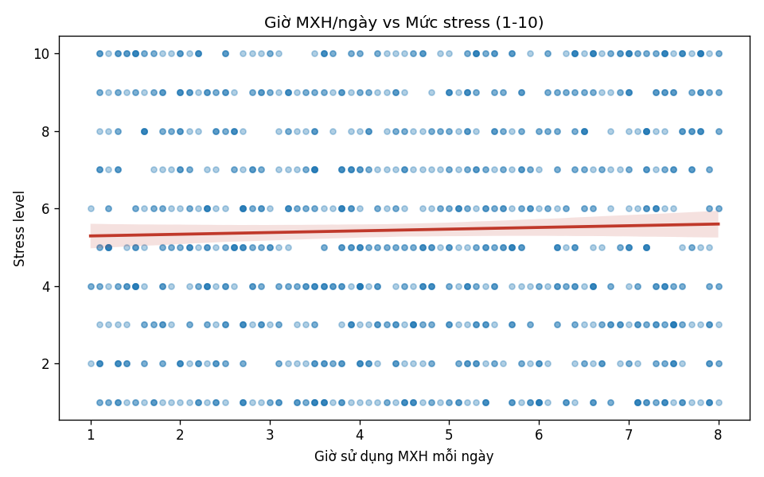

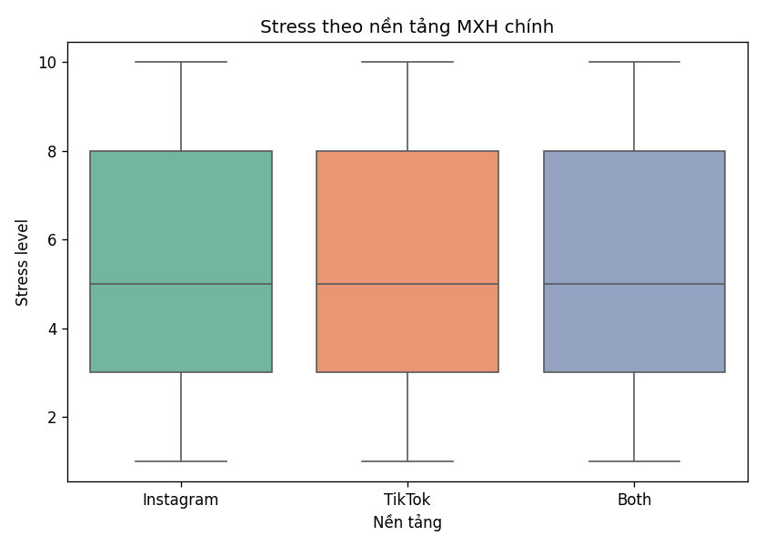

## 5. Các nghiên cứu tương đương

Phần này tóm tắt các hướng nghiên cứu thường gặp trong chủ đề tương tự:

- **Digital well-being studies**: xem xét tác động của thời gian dùng mạng xã hội đến tâm trạng, lo âu và cảm giác kiệt sức tinh thần.
- **Sleep mediation studies**: nhấn mạnh vai trò trung gian của giấc ngủ, đặc biệt là việc dùng màn hình trước khi ngủ làm xấu chất lượng ngủ và làm tăng nguy cơ stress.
- **Behavioral risk prediction**: sử dụng dữ liệu hành vi, học tập và tương tác xã hội để dự đoán nguy cơ trầm cảm hoặc căng thẳng.
- **Persona and clustering studies**: phân nhóm người dùng theo phong cách sử dụng mạng xã hội, mức stress và lối sống để hỗ trợ diễn giải kết quả.

So với các hướng trên, đồ án này chọn cách tiếp cận thực dụng hơn:

- Dùng tập feature có thể giải thích được.
- Kết hợp mô hình baseline, mô hình mạnh hơn và phân cụm.
- Đánh giá trên validation set và test set tách biệt để giảm nguy cơ chọn mô hình theo cảm tính.

## 6. Đề xuất giải pháp

Giải pháp được thiết kế thành 3 nhánh chính:

### 5.1 Nhánh phân loại

Dự đoán `depression_label` bằng hai nhóm mô hình:

- Machine learning truyền thống: Decision Tree, Random Forest, XGBoost, LightGBM nếu môi trường hỗ trợ.
- Deep learning cho dữ liệu bảng: MLP và FT-Transformer.

### 5.2 Nhánh xử lý mất cân bằng

Do dữ liệu có mất cân bằng lớp, đồ án thử đồng thời nhiều chiến lược:

- Baseline.
- Class weight / `scale_pos_weight`.
- SMOTE trong pipeline để tránh leakage.
- Weighted BCE và Focal Loss trong deep learning.
- Threshold tuning trên validation set để tối ưu F1 và minority recall.

### 5.3 Nhánh phân cụm đa góc nhìn

Mỗi góc nhìn mô tả một khía cạnh hành vi khác nhau:

- Usage intensity.
- Lifestyle health.
- Social behavior.
- Stress pattern.

Mỗi view chọn số cụm cố định theo ý nghĩa dữ liệu, rồi tối ưu kiểu biểu diễn bằng silhouette score.

## 7. Kiến trúc hệ thống

### 6.1 Luồng tổng thể

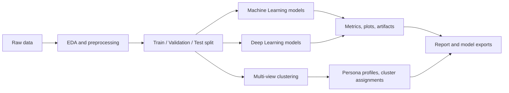
```mermaid
flowchart LR
	A[Raw data] --> B[EDA and preprocessing]
	B --> C[Train / Validation / Test split]
	C --> D[Machine Learning models]
	C --> E[Deep Learning models]
	C --> F[Multi-view clustering]
	D --> G[Metrics, plots, artifacts]
	E --> G
	F --> H[Persona profiles, cluster assignments]
	G --> I[Report and model exports]
	H --> I
```

### 6.2 Kiến trúc kỹ thuật

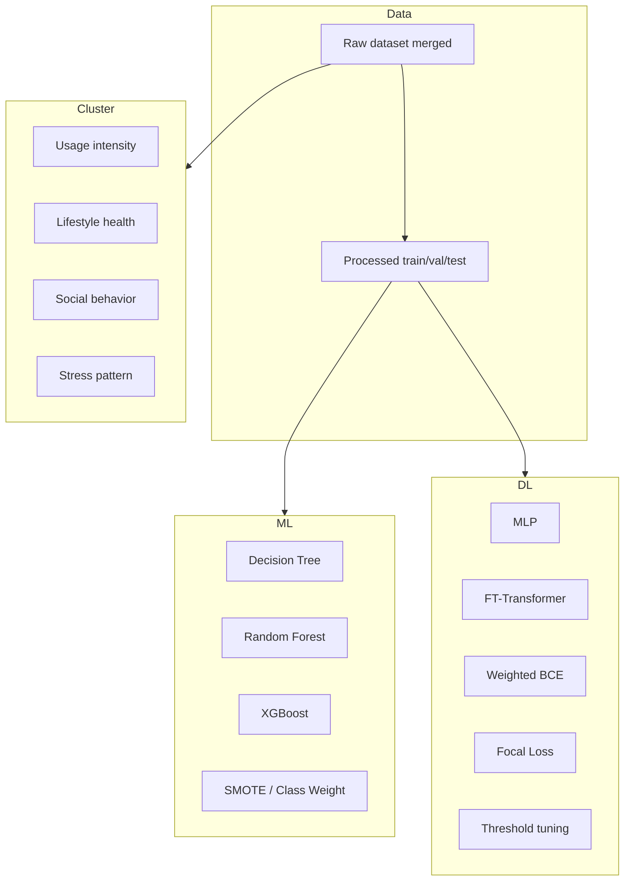
```mermaid
flowchart TB
	subgraph Data
		R[Raw dataset merged]
		P[Processed train/val/test]
	end

	subgraph ML
		M1[Decision Tree]
		M2[Random Forest]
		M3[XGBoost]
		M4[SMOTE / Class Weight]
	end

	subgraph DL
		D1[MLP]
		D2[FT-Transformer]
		D3[Weighted BCE]
		D4[Focal Loss]
		D5[Threshold tuning]
	end

	subgraph Cluster
		C1[Usage intensity]
		C2[Lifestyle health]
		C3[Social behavior]
		C4[Stress pattern]
	end

	R --> P
	P --> ML
	P --> DL
	R --> Cluster
```

## 8. Triển khai kỹ thuật

### 7.1 Tiền xử lý

Notebook EDA và preprocessing thực hiện các bước chính:

- Đồng bộ schema giữa các tập.
- Loại bỏ hoặc xử lý missing và giá trị vô hạn.
- Ép kiểu nhãn mục tiêu về int.
- Giữ thứ tự cột đồng nhất giữa train, validation và test.

### 7.2 Machine learning

Notebook `02_ml_models.ipynb` triển khai:

- Decision Tree.
- Random Forest.
- XGBoost nếu có cài đặt.
- LightGBM nếu có cài đặt.

Quy trình đánh giá gồm:

1. Xây dựng candidate cho từng mô hình và từng chiến lược imbalance.
2. Cross-validation bằng `StratifiedKFold`.
3. Grid search hyperparameter trên train folds.
4. Chọn candidate tốt nhất theo validation set gốc.
5. Retrain trên toàn bộ train set.
6. Đánh giá cuối cùng trên test set.

### 7.3 Deep learning

Notebook `03_dl_models.ipynb` triển khai:

- MLP classifier.
- FT-Transformer classifier.

Điểm chính của phần DL:

- Dùng `BCEWithLogitsLoss` có `pos_weight` để xử lý mất cân bằng.
- Dùng Focal Loss để tập trung vào mẫu khó.
- Tự động tìm threshold tối ưu trên validation set.
- Lưu loss log theo epoch và theo step.

### 7.4 Clustering đa góc nhìn

Notebook `04_clustering.ipynb` chia dữ liệu thành các view ý nghĩa, sau đó:

- Chuẩn hóa feature bằng `StandardScaler`.
- So sánh `KMeans`, `PCA2 + KMeans`, `PCA3 + KMeans`.
- Chọn method có silhouette tốt nhất trên validation split.
- Sinh cluster profile và tên persona cho từng cụm.

## 9. Mô hình đề xuất

Mô hình đề xuất chính của đồ án gồm 2 lớp:

### 8.1 Mô hình dự đoán chính

Trong nhánh supervised, các model được chia rõ thành 2 nhóm:

- **Machine Learning**: Decision Tree, Random Forest, XGBoost, LightGBM.
- **Deep Learning**: MLP, FT-Transformer.

Đồ án không chỉ chọn một model duy nhất mà log kết quả theo từng family, từng chiến lược xử lý mất cân bằng, và từng tập đánh giá.

#### Kết quả Machine Learning

Các candidate ML được chạy theo 3 chiến lược: Baseline, Class Weight và SMOTE. Kết quả tốt nhất hiện tại là **XGBoost + SMOTE** trên test set.

##### Bảng log validation cho các candidate ML

| Model ML | Chiến lược | Best CV F1 | Validation F1 | Validation Macro F1 | Validation Minority Recall | Validation ROC-AUC |
|---|---|---:|---:|---:|---:|---:|
| XGBoost | SMOTE | 0.7805 | 0.8198 | 0.8874 | 0.9891 | 0.9548 |
| XGBoost | Baseline | 0.7591 | 0.8186 | 0.8875 | 0.9565 | 0.9564 |
| Random Forest | Class Weight | 0.7914 | 0.8145 | 0.8842 | 0.9783 | 0.9594 |
| XGBoost | Class Weight | 0.7967 | 0.8053 | 0.8778 | 0.9891 | 0.9521 |
| Random Forest | SMOTE | 0.7873 | 0.8073 | 0.8801 | 0.9565 | 0.9594 |
| Decision Tree | SMOTE | 0.7713 | 0.8073 | 0.8801 | 0.9565 | 0.9450 |

##### Bảng test cuối cho best ML model

| Model ML | Chiến lược | Test Accuracy | Test Precision | Test Recall | Test F1 | Test Macro F1 | Test Minority Recall | Test ROC-AUC |
|---|---|---:|---:|---:|---:|---:|---:|---:|
| XGBoost | SMOTE | 0.9027 | 0.6583 | 0.8587 | 0.7453 | 0.8426 | 0.8587 | 0.9480 |

Ghi chú: bảng này ưu tiên những candidate đầu bảng trong file `results/metrics/ml_validation_metrics.csv` và `results/metrics/final_test_metrics.csv`. Nếu muốn log đầy đủ toàn bộ candidate, xem trực tiếp các file metric này.

#### Kết quả Deep Learning

Các experiment DL được chia theo model family và loss function. Kết quả nổi bật hiện tại là **FT-Transformer + Weighted BCE + Label Smoothing**.

| Model DL | Chiến lược | Threshold | Accuracy | Balanced Accuracy | Precision | Recall | F1 | Macro F1 | Minority Recall | ROC-AUC |
|---|---|---:|---:|---:|---:|---:|---:|---:|---:|---:|
| FT-Transformer | Weighted BCE + Label Smoothing | 0.23 | 0.9207 | 0.9438 | 0.6818 | 0.9783 | 0.8036 | 0.8770 | 0.9783 | 0.9542 |
| FT-Transformer | Focal Loss + Label Smoothing + Hard Negative Mining | 0.54 | 0.9189 | 0.9209 | 0.6911 | 0.9239 | 0.7907 | 0.8702 | 0.9239 | 0.9542 |
| FT-Transformer | Weighted BCE | 0.86 | 0.9153 | 0.9231 | 0.6772 | 0.9348 | 0.7854 | 0.8663 | 0.9348 | 0.9501 |
| FT-Transformer | Focal Loss + Label Smoothing | 0.59 | 0.9117 | 0.9122 | 0.6720 | 0.9130 | 0.7742 | 0.8597 | 0.9130 | 0.9558 |
| FT-Transformer | Focal Loss | 0.61 | 0.9081 | 0.9057 | 0.6640 | 0.9022 | 0.7650 | 0.8539 | 0.9022 | 0.9543 |
| MLP | Weighted BCE | 0.80 | 0.8973 | 0.8688 | 0.6496 | 0.8261 | 0.7273 | 0.8320 | 0.8261 | 0.9446 |
| MLP | Focal Loss | 0.53 | 0.8955 | 0.8677 | 0.6441 | 0.8261 | 0.7238 | 0.8297 | 0.8261 | 0.9468 |

Như vậy, nếu tách riêng theo family thì phần **ML** mạnh nhất hiện tại là XGBoost với SMOTE, còn phần **DL** mạnh nhất là FT-Transformer với Weighted BCE và label smoothing.

### 8.2 Mô hình diễn giải persona

Nhánh clustering không thay thế classifier, mà dùng để tạo lớp diễn giải:

- Persona theo mức sử dụng mạng xã hội.
- Persona theo sức khỏe lối sống.
- Persona theo hành vi xã hội.
- Persona theo cấu hình stress.

Kết quả này giúp chuyển từ “dự đoán rủi ro” sang “giải thích kiểu người dùng” để báo cáo dễ đọc hơn.

## 10. Kết quả đánh giá

### 9.1 Machine learning

Các file đầu ra trong `results/metrics/` ghi lại đầy đủ và tách riêng theo từng model ML:

- `ml_metrics_cv.csv`: kết quả cross-validation.
- `ml_tuning_results.csv`: kết quả grid search.
- `ml_validation_metrics.csv`: đánh giá trên validation set.
- `final_test_metrics.csv`: đánh giá cuối trên test set.
- `final_classification_report.csv`: classification report.
- `final_confusion_matrix.csv`: confusion matrix.
- `feature_importance_best_model.csv`: feature importance của model tốt nhất.

Những model ML đã được chạy và log trong notebook gồm:

- Decision Tree | Baseline
- Decision Tree | Class Weight
- Decision Tree | SMOTE
- Random Forest | Baseline
- Random Forest | Class Weight
- Random Forest | SMOTE
- XGBoost | Baseline
- XGBoost | Class Weight
- XGBoost | SMOTE
- LightGBM, nếu môi trường có cài đặt

Figure trực quan cho ML nằm ở:

- `figures/models/decision_tree_results.png`
- `figures/models/random_forest_results.png`
- `figures/models/xgboost_results.png`
- `figures/models/decision_tree_confusion_matrix.png`
- `figures/models/random_forest_confusion_matrix.png`
- `figures/models/xgboost_confusion_matrix.png`
- `figures/models/model_comparison_f1_score.png`

### 9.2 Deep learning

File metric quan trọng cho DL, tách rõ theo từng experiment:

- `results/metrics/dl_validation_metrics.csv`
- `results/metrics/dl_test_metrics.csv`
- `results/metrics/dl_best_confusion_matrix.csv`
- `results/metrics/dl_best_classification_report.csv`
- `results/metrics/dl_epoch_loss_log.csv`
- `results/metrics/dl_step_loss_log.csv`

Những experiment DL đã được log gồm:

- MLP | Weighted BCE
- MLP | Focal Loss
- FT-Transformer | Weighted BCE
- FT-Transformer | Focal Loss
- FT-Transformer | Weighted BCE + Label Smoothing
- FT-Transformer | Focal Loss + Label Smoothing
- FT-Transformer | Weighted BCE + Label Smoothing + Hard Negative Mining
- FT-Transformer | Focal Loss + Label Smoothing + Hard Negative Mining

Figure trực quan cho DL:

- `figures/models/dl_validation_loss.png`
- `figures/models/dl_best_confusion_matrix.png`

### 9.3 Clustering

Kết quả clustering được lưu ở:

- `results/clustering/multi_view_candidate_silhouette.csv`
- `results/clustering/multi_view_clustering_metrics.csv`
- `results/clustering/multi_view_cluster_profiles.csv`
- `results/clustering/multi_view_cluster_assignments.csv`
- `results/clustering/combined_persona_summary.csv`

Các figure chính cho phần clustering:

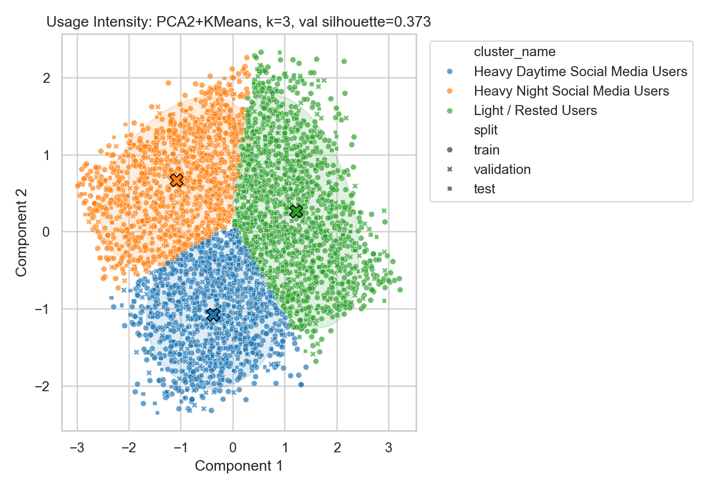

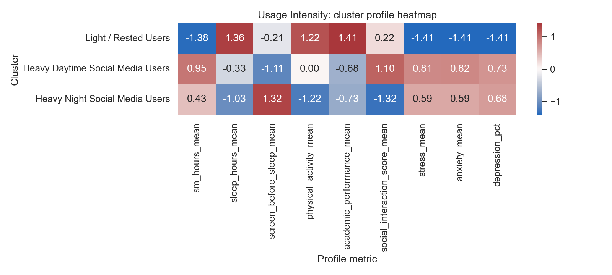

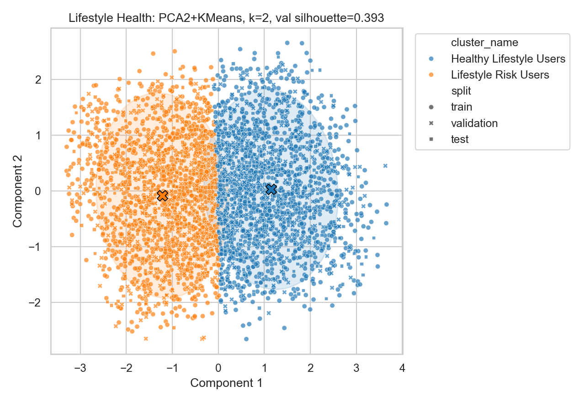

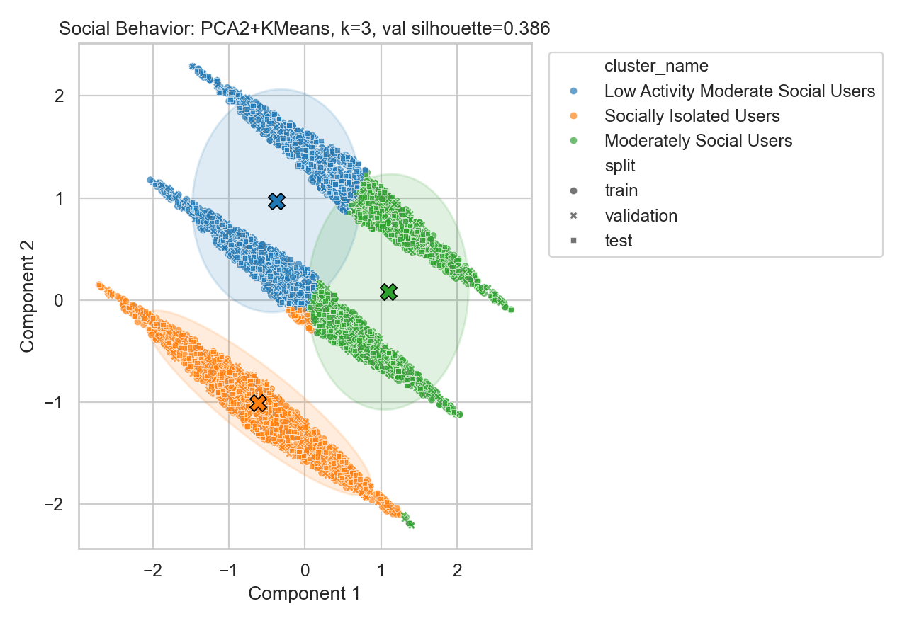

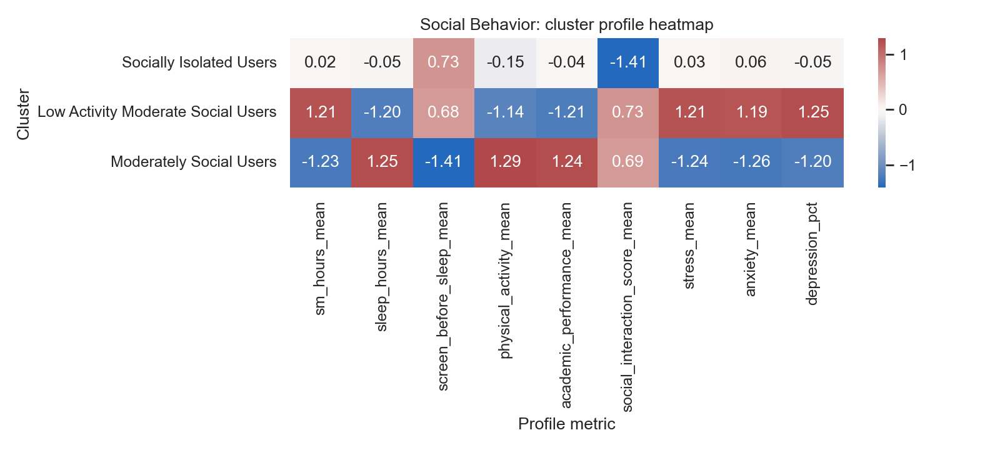

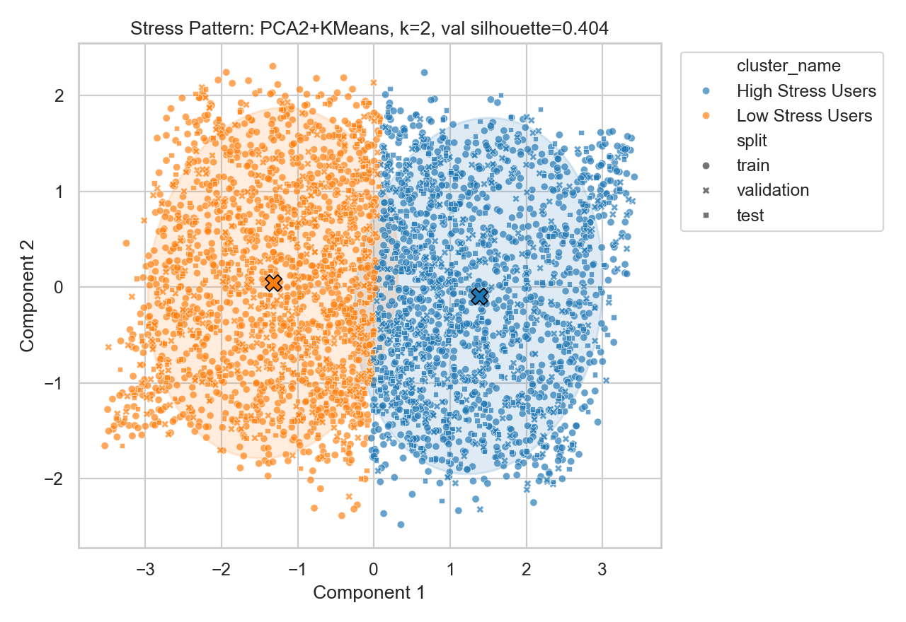

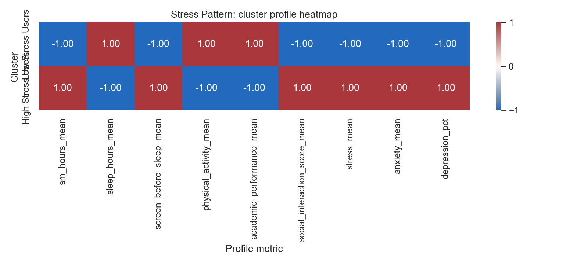

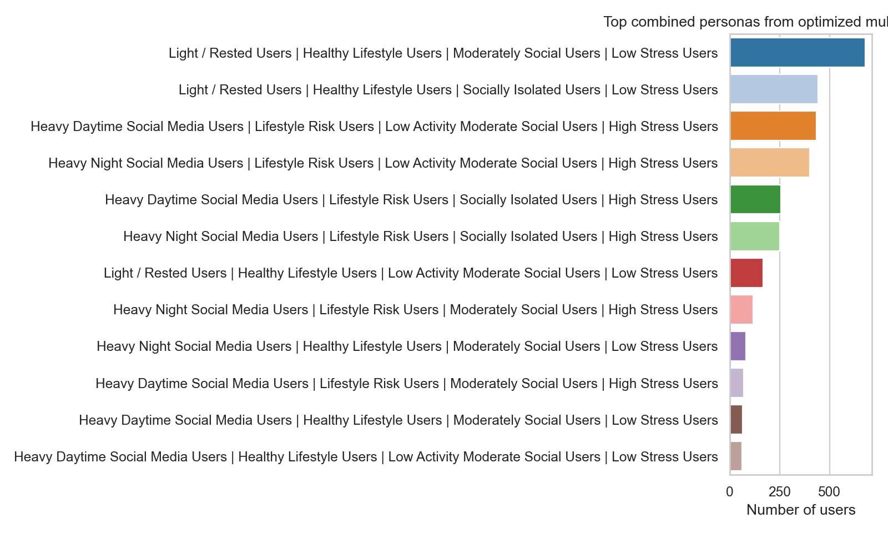

### 9.4 Tổng hợp best silhouette theo view

| View | Method tốt nhất | k | Train silhouette | Validation silhouette | Test silhouette |
|---|---|---:|---:|---:|---:|
| Usage intensity | PCA2 + KMeans | 3 | 0.3638 | 0.3729 | 0.3748 |
| Lifestyle health | PCA2 + KMeans | 2 | 0.3879 | 0.3925 | 0.3807 |
| Social behavior | PCA2 + KMeans | 3 | 0.3996 | 0.3861 | 0.3979 |
| Stress pattern | PCA2 + KMeans | 2 | 0.4070 | 0.4041 | 0.4079 |

## 11. Hình minh họa kết quả chính

### 10.1 EDA

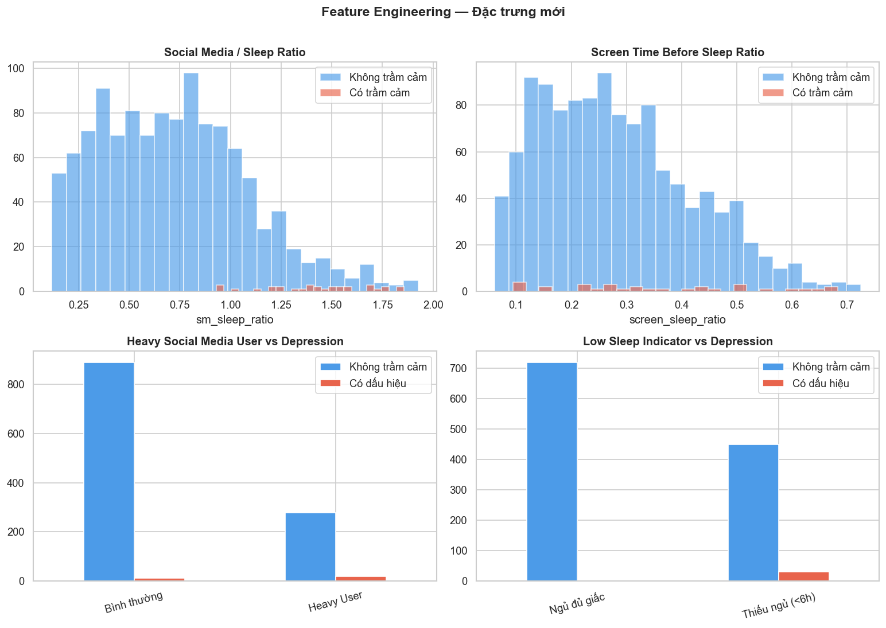

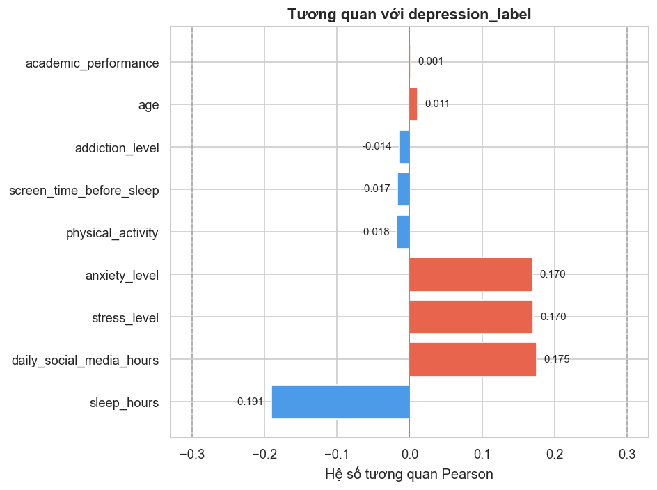

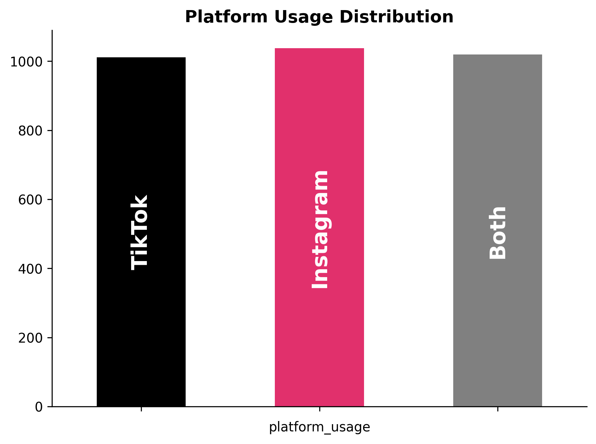

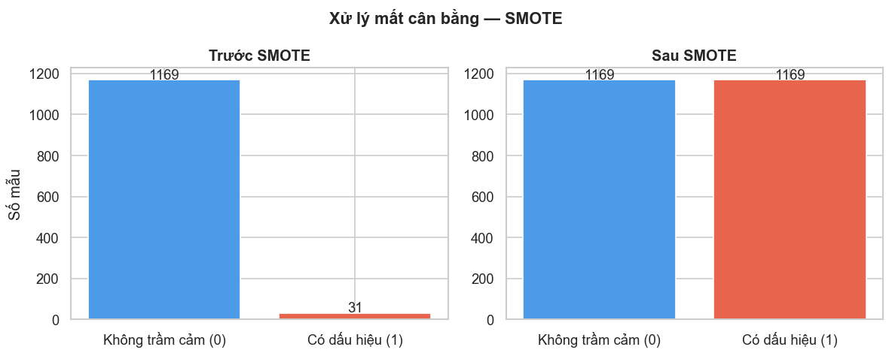

### 10.2 Mô hình ML

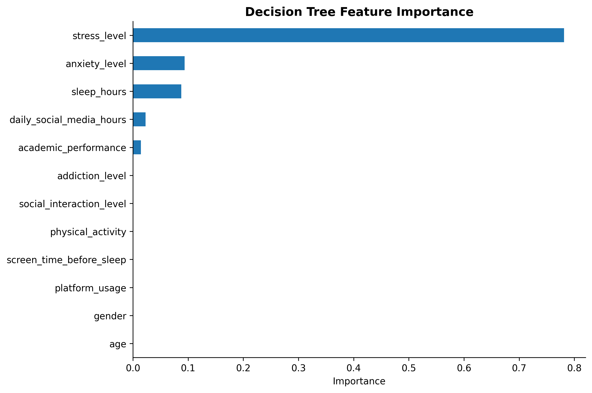

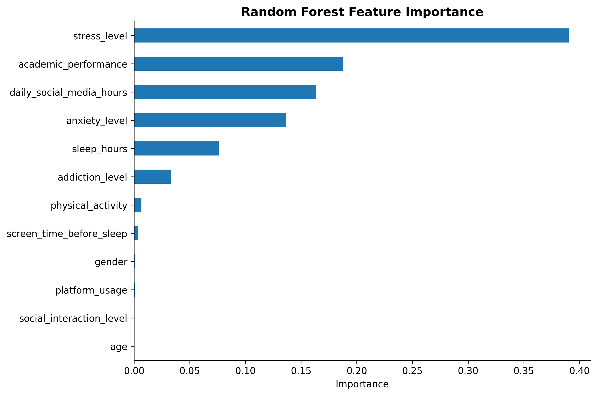

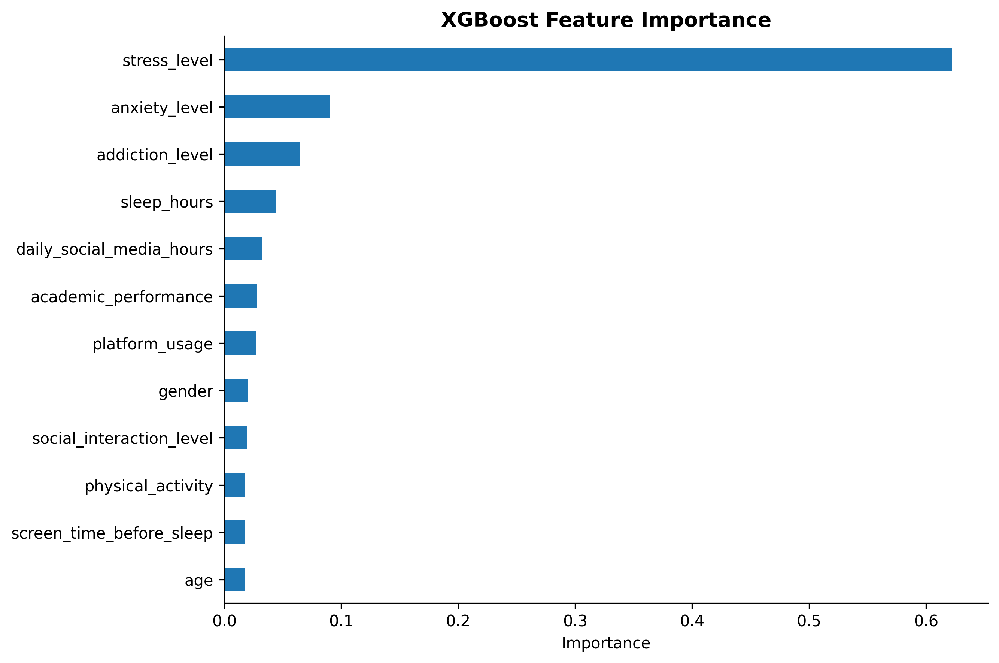

### 10.3 Mô hình DL

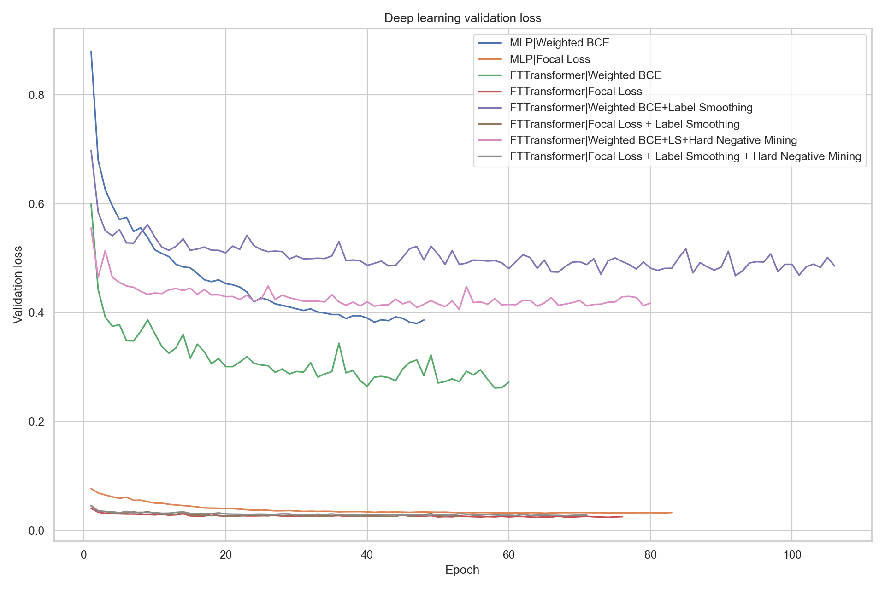

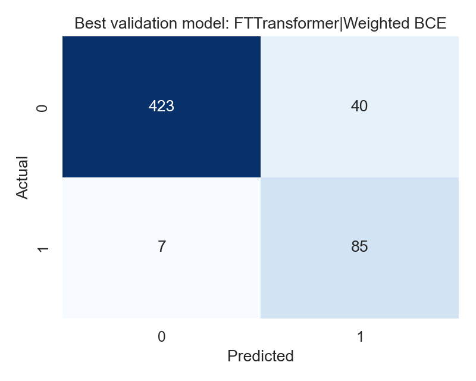

## 12. Đầu ra bàn giao

Dự án hiện sinh ra các nhóm đầu ra sau:

### 11.1 Dữ liệu đã xử lý

- `data/processed/train_data.csv`
- `data/processed/validation_data.csv`
- `data/processed/test_data.csv`
- `data/processed/preprocessed_data.csv`
- `data/processed/smote_data.csv`

### 11.2 Mô hình ML

- `models/ml/best_model.pkl`
- `models/ml/top1_*.pkl`
- `models/ml/top2_*.pkl`
- `models/ml/top3_*.pkl`
- `models/ml/exported_top_models.csv`

### 11.3 Mô hình DL

- `models/dl/best_dl_model.pt`
- `models/dl/best_dl_model_meta.json`
- `models/dl/exported_top_dl_models.csv`

### 11.4 Clustering

- `models/clustering/*.pkl`
- `results/clustering/*.csv`
- `figures/clustering/*.png`

### 11.5 Báo cáo và biểu đồ

- `results/metrics/*.csv`
- `results/figures/*.png`
- `figures/eda/*.png`
- `figures/models/*.png`

## 13. Kết luận

Đồ án cho thấy rằng ảnh hưởng của mạng xã hội đến sức khỏe tâm lý của trẻ vị thành niên không thể nhìn qua một biến đơn lẻ, mà là kết quả của tổ hợp nhiều yếu tố: thời gian sử dụng, thói quen trước khi ngủ, chất lượng ngủ, hoạt động thể chất, tương tác xã hội và áp lực học tập.

Về mặt mô hình, XGBoost/FT-Transformer cho kết quả tốt hơn các baseline đơn giản, đặc biệt khi kết hợp với chiến lược xử lý mất cân bằng và tuning threshold.

Về mặt diễn giải, multi-view clustering giúp chuyển kết quả mô hình thành các persona dễ báo cáo hơn, hỗ trợ phần trình bày và ra quyết định.

## 14. Gợi ý mở rộng

Nếu cần hoàn thiện thành báo cáo nộp chính thức, có thể bổ sung thêm:

- Trích dẫn tài liệu tham khảo theo APA hoặc IEEE.
- Mô tả chi tiết hơn về từng feature và tiền xử lý ở notebook EDA.
- Bổ sung bảng so sánh thống nhất giữa ML, DL và clustering.
- Xuất thêm file Word/PDF từ nội dung này.

## 15. Ghi chú về cấu trúc thư mục

Thư mục `sections/` có thể dùng để tách báo cáo thành các phần nhỏ như:

- `01_overview.md`
- `02_eda.md`
- `03_modeling.md`
- `04_clustering.md`
- `05_conclusion.md`

Hiện tại, toàn bộ nội dung đã được gom vào `report/README.md` để tiện đọc và làm khung báo cáo chính.